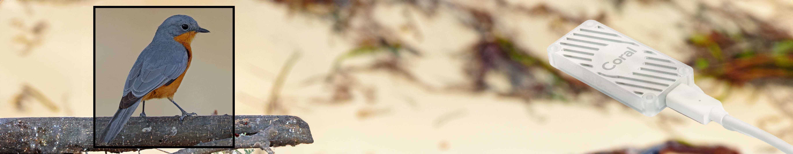

<p align="center">
  
</p>

### The power of [`Coral Edge TPU`](https://coral.ai/docs/accelerator/get-started/#requirements) and [`Ultralytics`](https://docs.ultralytics.com/) all in one place: [`edge-tpu-silva`](https://pypi.org/project/edge-tpu-silva/).

Our **edge-tpu-silva** is a Python package that simplifies the installation of the Coral TPU USB dependency and ensures compatibility with PyCoral and Ultralytics. This package empowers object `detection`, `segmentation` and `classification` capabilities on various edge devices to achieve higher `FPS` (Real Time Processor Speed).

## [Hardware Requirement](https://coral.ai/products/accelerator/)
`Coral USB Accelerator Exclusivity`:

The edge-tpu-silva library is purpose-built for seamless integration with the Coral USB Accelerator. This powerful hardware accelerator is not just a requirement but a strategic choice, unlocking the library's full potential for superior object `detection`, `segmentation` and `classification`.

[Discover the Coral USB Accelerator](https://coral.ai/products/accelerator/) and experience a tailored approach to edge computing with the edge-tpu-silva library.

## [Do This Before Installing the Package]()

The package `edge-tpu-silva` is only compactible with `python versions <3.10`. Install specific python version if your python version is not compatible.

>**Example:** For `Raspberry Pi` you can [Click For instructions](https://github.com/DAVIDNYARKO123/pyenv) on how to install specific python version using pyenv

>**Note:** Python 3.6 to 3.9 is Recommended, Click on link above on how to install [specific python](https://github.com/DAVIDNYARKO123/pyenv) version

>**Note:** Be sure your Raspberry Pi is up to date. To do so, run below command in terminal.
>```bash
>sudo apt-get update
>```
>```bash
>sudo apt-get upgrade
>```

## [Installation](#)

Run the bash code below in your terminal to create and activate a new virtual environment named `.venv`. Ensure you are in the specific directory you want this environment to be installed.

```bash
python3 -m venv .venv
source .venv/bin/activate
```

### Step 1: Install edge-tpu-silva

To install **edge-tpu-silva**, use the following pip command in a specified python environment:

```bash
pip install edge-tpu-silva
```


### Step 2: Run Setup Command

### [System Compatibility](#)

This table provides an overview of the compatibility of the system with different devices and operating systems.

|                       | Compatibility     | Setup Command             |
| --------------------- | ------------------ | ------------------------- |
| Raspberry Pi 5        | ✔                  | silvatpu-linux-setup      |
| Raspberry Pi 4        | ✔                  | silvatpu-linux-setup      |
| Raspberry Pi 3        | ✔                  | silvatpu-linux-setup      |
| Jetson Nano           | ✔                  | silvatpu-linux-setup      |
| Windows               | ❌                 |                           |
| macOS                 | ❌                 |                           |

In order to configure setup tools for your system, run the setup command in the terminal after step 1 is completed.

Example: If you are on a Raspberry Pi 5, run below command in the terminal following step 1.

```bash
silvatpu-linux-setup
```

The command installs the standard Edge TPU runtime for Linux, running the device at a reduced clock frequency. Alternatively, you can install a version for maximum speed, but be cautious of increased power consumption and device heat. If unsure, stick to the reduced frequency for safety. To install maximum frequency runtime, specify the speed of the setup command to `max`.

```bash
silvatpu-linux-setup --speed max
```
You cannot have both versions of the runtime installed at the same time, but you can switch by simply installing the alternate runtime as shown above

>**Caution:** Using the USB Accelerator at maximum clock frequency can make it dangerously hot. To prevent burn injuries, keep it out of reach or operate it at a reduced clock frequency.

> **Note:** Please ensure that you have the `Coral USB Accelerator` connected through `usb 3.0 port (for faster speed)`. If the Coral USB Accelerator was connected during the installation and setup, please disconnect and reconnect it to ensure `proper configuration.`


## [Models]()

To unleash the power of object `detection`, `segmentation`, and `classification` with this library, you'll need an Edge TPU-compatible .tflite model. These models should be exported using [`Ultralytics`](https://docs.ultralytics.com/modes/export/), ensuring a seamless integration with the edge-tpu-silva library.

> **NOTE:** Please be aware that the `imgsz` value specified during YOLO export should align with the same value used when defining `imgsz` for any of the processes. Consistency in these settings is crucial for optimal performance.

Smaller models will run faster but may have lower accuracy, while larger models will run slower but typically have higher accuracy. Explore the capabilities of edge computing with below models using edge-tpu-silva library.


| Download Link | Process | Base Model | imgsz          | Object Classes   |
|--------------- |---------|------------|----------------|------------------ |
| [Download Model](https://github.com/DAVIDNYARKO123/edge-tpu-silva/blob/main/models/240_yolov8n_full_integer_quant_edgetpu.tflite?raw=true) | Detection | yolov8n.pt | `240` | [COCO128](https://github.com/DAVIDNYARKO123/edge-tpu-silva/blob/main/asset/classes/coco128.txt) |
| [Download Model](https://github.com/DAVIDNYARKO123/edge-tpu-silva/blob/main/models/240_yolov8n-seg_full_integer_quant_edgetpu.tflite?raw=true) | Segmentation | yolov8n-seg.pt | `240` | [COCO128](https://github.com/DAVIDNYARKO123/edge-tpu-silva/blob/main/asset/classes/coco128.txt) |
| [Download Model](https://github.com/DAVIDNYARKO123/edge-tpu-silva/blob/main/models/192_yolov8n_full_integer_quant_edgetpu.tflite?raw=true) | Detection | yolov8n.pt | `192` | [COCO128](https://github.com/DAVIDNYARKO123/edge-tpu-silva/blob/main/asset/classes/coco128.txt) |
| [Download Model](https://github.com/DAVIDNYARKO123/edge-tpu-silva/blob/main/models/192_yolov8n-seg_full_integer_quant_edgetpu.tflite?raw=true) | Segmentation | yolov8n-seg.pt | `192` | [COCO128](https://github.com/DAVIDNYARKO123/edge-tpu-silva/blob/main/asset/classes/coco128.txt) |
| [Download Model](https://github.com/DAVIDNYARKO123/edge-tpu-silva/blob/main/models/640_yolov8n-cls_full_integer_quant_edgetpu.tflite?raw=true) | Classification | yolov8n-cls.pt | `640` | [ImageNet](https://github.com/DAVIDNYARKO123/edge-tpu-silva/blob/main/asset/classes/imagenet.txt) |
| [Download Model](https://github.com/DAVIDNYARKO123/edge-tpu-silva/blob/main/models/240_yolov9c_full_integer_quant_edgetpu.tflite?raw=true) | Detection | yolov9c.pt | `240` | [COCO128](https://github.com/DAVIDNYARKO123/edge-tpu-silva/blob/main/asset/classes/coco128.txt) |

> **NOTE:** The YOLOv9 model, particularly the YOLOv9c.pt version, is substantial in size, which leads to its TensorFlow Lite version also being quite large. As a result, its processing speed on an Edge TPU is comparatively slower.

## Usage

### [Object Detection Process](#)

To perform object detection using the `process_detection` function, you can follow this example:

```python
from edge_tpu_silva import process_detection

# Run the object detection process
outs = process_detection(model_path='path/to/your/model.tflite', input_path='path/to/your/input/video.mp4', imgsz=192)

for _, _ in outs:
  pass
```

#### Running `process_detection` in the Terminal: Using the Entry Point "silvatpu"

To perform object detection with the `process_detection` function from the command line, you can use the user-friendly entry point `silvatpu`. Here's an example command:

```bash
silvatpu -p det -m path/to/model.tflite -i path/to/input/video.mp4 -z 192 -t 0.5 -v True
```

### [Object Segmentation Process](#)

To perform object segmentation using the `process_segmentation` function, you can follow this example:

```python
from edge_tpu_silva import process_segmentation

# Run the object segmentation process
outs = process_segmentation(model_path='path/to/your/model.tflite', input_path='path/to/your/input/video.mp4', imgsz=192)

for _, _ in outs:
  pass
```

#### Running `process_segmentation` in the Terminal: Using the Entry Point "silvatpu"

To perform object segmentation with the `process_segmentation` function from the command line, you can use the user-friendly entry point `silvatpu`. Here's an example command:

```bash
silvatpu -p seg -m path/to/model.tflite -i path/to/input/video.mp4 -z 192 -t 0.5 -v True
```


### Process `detection`, `segmentation` and `classification` Function Input Parameters

| Parameter      | Description                                        | Default Value |
| --------------- | -------------------------------------------------- | ------------- |
| `model_path`    | Path to the object segmentation model.             | \-            |
| `input_path`    | File path of image/video to process (Camera(0\|1\|2)). | \-           |
| `imgsz`         | Defines the image size for inference.  | \-             |
| `threshold`     | Threshold for detected objects.                    | `0.4`         |
| `verbose`       | Display prints to the terminal.                    | `True`        |
| `show`          | Display frame with segmentation.                   | `False`       |
| `classes`       | Filters predictions to a set of class IDs. | `None`            |


### Process `detection`, `segmentation` and `classification` Function Output

Each process function yields the following output:

| Output Parameter | Description                                   |
| ----------------- | --------------------------------------------- |
| `objs_lst`        | List of objects detected in frame.            |
| `fps`             | Frames per second (fps) of the processed frame. |

Example usage:

```python
from edge_tpu_silva import process_detection

# Run the object detection process
outs = process_detection(model_path='path/to/your/model.tflite', input_path='path/to/your/input/video.mp4', imgsz=192)

for objs_lst, fps in outs:
    # Access the output parameters as needed
    print(f"Processed frame with {len(objs_lst)} objects. FPS: {fps}")
    print("List of object predictions in frame:")
    print(objs_lst)
```

## [Contribution]()
Contributions are welcome! If you find any issues or have suggestions for improvements, please open an issue or submit a pull request.

Python Package Index Maintainer(s) (c) [2024] [David Nyarko](https://github.com/DAVIDNYARKO123)
